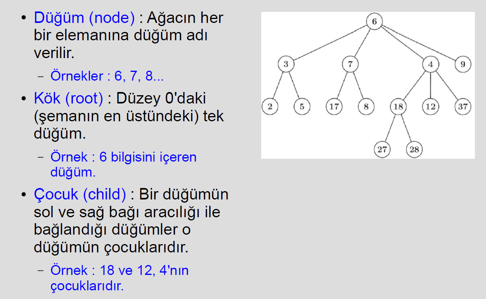

Ağaç veri yapısı, bilgisayar bilimlerinde hiyerarşik yapıyı modellemek için kullanılır. Genellikle düğümlerin (nodes) birbirine bağlı olduğu bir yapıdır ve her düğüm, bir veri öğesi ve alt düğümlerini (child) içerir. Ağaçlar birçok farklı şekilde sınıflandırılabilir ve çeşitli uygulamalara sahiptir, özellikle arama algoritmaları, veritabanı yönetimi, grafik işleme ve oyun programlama gibi alanlarda kullanılır. Şimdi ağaç veri yapısı ile ilgili terimleri ve türleri adım adım inceleyelim.

### Ağaç Veri Yapısı Temel Kavramları:
#### Node (Düğüm):
* Ağaçta her bir düğüm, bir veri parçasını ve diğer düğümlere işaret eden bağlantıları içerir. Düğüm, genellikle data ve children (alt düğümler) içerir.
* Örneğin, bir düğümde sayısal değerler, karakterler veya karmaşık veri yapıları bulunabilir.

#### Root (Kök):
* Ağacın en üstündeki düğüme "root" denir. Bir ağaç yalnızca bir kök düğüme sahiptir. Kök düğümün "parent" (ebeveyn) düğümü yoktur.
* Ağaçlar kökten başlayarak büyür.

#### Child (Çocuk):
* Bir düğümün kendisinden bir seviye aşağıdaki düğümlere "child" denir. Örneğin, kök düğümün altındaki düğümler onun çocuklarıdır.
Bir düğüm, birden fazla çocuğa sahip olabilir.

#### Parent (Ebeveyn):

* Bir düğüm, bir veya daha fazla çocuğa sahip olabilir ve bu durumda düğüm "parent" (ebeveyn) olarak adlandırılır. Bir çocuğun yalnızca bir ebeveyni olabilir.

#### Leaf (Yaprak):
 * Hiç çocuğu olmayan düğümler "leaf" (yaprak) olarak adlandırılır. Yaprak düğümler ağacın en uçtaki düğümleridir.

#### Level (Seviye):
* Ağacın her bir katmanı "level" olarak adlandırılır. Kök düğüm 0. seviyededir. Kökten bir düğüme giden yolun uzunluğu seviyeyi belirler. 
Çocuklar, ebeveynlerinden bir seviye aşağıdadır.

#### Depth (Derinlik):
* Belirli bir düğümün kök düğümden itibaren uzaklığına "depth" (derinlik) denir. Kök düğümün derinliği 0’dır.

#### Depth of Tree (Ağacın Derinliği):
* Ağacın en alt yaprak düğümüne kadar olan maksimum seviyeye "depth of tree" (ağacın derinliği) denir.
Bir ağaçtaki en uzun yolun uzunluğu, ağacın derinliğidir.

#### Sibling (Kardeş):
* Aynı ebeveyne sahip düğümler "sibling" (kardeş) olarak adlandırılır. Bir ebeveynin birden fazla çocuğu varsa, bu çocuklar birbirlerinin kardeşleridir.

#### Ancestor (Ata):
* Bir düğümün kökten kendisine kadar olan yol üzerindeki tüm düğümlerine "ancestor" (ata) denir. Örneğin, kök bir düğümün atasındadır.

#### Descendant (Torun):
* Bir düğümün altındaki tüm düğümler onun "descendant" (torun) olarak adlandırılır. Kök düğümden aşağıya doğru inen her düğüm torun sayılır.

### Ağaç Türleri ve Çeşitleri
#### Binary Tree (İkili Ağaç):
* Her düğüm en fazla iki çocuğa sahip olabilir (sol ve sağ çocuk). Bu basit ağaç türü, arama işlemleri için oldukça uygundur.
* İkili arama ağacı bu türün özel bir çeşididir, burada sol alt ağacın tüm değerleri düğümün değerinden küçüktür, sağ alt ağacın tüm değerleri ise düğümün değerinden büyüktür.

#### Full Binary Tree (Tam İkili Ağaç):
* Bir ikili ağaçta her düğüm ya sıfır ya da tam iki çocuğa sahipse, bu ağaç "full binary tree" olarak adlandırılır.

#### Complete Binary Tree (Tamamlanmış İkili Ağaç):

* Ağacın tüm seviyeleri tamamen doldurulmuşsa (son seviye hariç) ve son seviye soldan sağa doğru doldurulmuşsa, bu ağaç "complete binary tree" olarak adlandırılır.

#### Balanced Binary Tree (Dengeli İkili Ağaç):
* İkili ağaçta, her alt ağacın derinlik farkı en fazla 1 ise bu ağaç "balanced binary tree" olarak adlandırılır. AVL ağacı ve kırmızı-siyah ağaçlar, dengeli ağaçlara örnektir.

#### Binary Search Tree (İkili Arama Ağacı - BST):
* Sol alt ağacın değerleri düğümün değerinden küçük, sağ alt ağacın değerleri ise düğümün değerinden büyük olduğu ikili ağaç yapısıdır.
BST'de arama, ekleme ve silme işlemleri ortalama O(log n) zaman karmaşıklığı ile gerçekleşir.

#### Heap (Yığın Ağacı):
* Yığın ağacı, her düğümün altındaki çocuk düğümlerden daha büyük (max-heap) veya daha küçük (min-heap) olduğu bir ağacıdır.
Yığın, öncelikli kuyruk gibi veri yapılarında kullanılır.

#### AVL Tree:
* Denge sağlanan bir ikili arama ağacıdır. Her düğümün altındaki alt ağaçların derinlik farkı en fazla 1 olabilir. Denge bozulduğunda, dengelemek için ağaç rotasyonları yapılır.

### Ağaç Veri Yapılarının Uygulamaları:
* İkili Arama Ağaçları (BST), verimli arama, ekleme ve silme işlemleri için yaygın olarak kullanılır.
* AVL ve Red-Black Ağaçları, verilerin sürekli eklenip çıkarıldığı durumlarda dengeyi koruyarak verimli performans sağlar.
* Heap Ağaçları, öncelikli kuyrukların verimli bir şekilde uygulanmasında kullanılır (örneğin, Dijkstra algoritması gibi).
* Trie (Prefix Tree), kelime arama ve metin tabanlı uygulamalar (otomatik tamamlama, sözlük uygulamaları) için kullanılır.
* Ağaçlar, çeşitli algoritmaların ve veri yapılarını etkinleştiren temel bileşenlerdir. Özellikle, derinlik öncelikli arama (DFS), genişlik öncelikli arama (BFS) ve ağaç üzerinde rekürsif algoritmalar çok sık kullanılır.

### Binary Tree İşlemleri:
* Ekleme (Insertion):
Yeni bir düğüm, belirli kurallara göre ağaçta uygun bir yere eklenir. Eğer Binary Search Tree (BST) ise, sol alt ağaca veya sağ alt ağaca göre karar verilir.

* Silme (Deletion):
Bir düğüm silinirken üç durum ortaya çıkabilir: Düğüm bir yaprak düğüm olabilir, tek çocuğu olabilir veya iki çocuğu olabilir. Her duruma göre farklı bir işlem yapılır.
İki çocuklu bir düğüm silindiğinde, ya sağ alt ağaçtaki en küçük düğüm (in-order successor) ya da sol alt ağaçtaki en büyük düğüm (in-order predecessor) kullanılarak ağaç yeniden düzenlenir.

* Arama (Search):
Binary Search Tree'de bir veri aranırken, kök düğümden başlayarak veri karşılaştırılır ve verinin büyüklüğüne göre sol veya sağ alt ağaca gidilir.

##### Gezinme (Traversal):
İkili ağaçlardaki düğümleri dolaşmanın dört ana yolu vardır:

* Preorder Traversal: Önce kök düğüm, ardından sol alt ağaç ve sonra sağ alt ağaç gezilir.

* Inorder Traversal: Önce sol alt ağaç, ardından kök düğüm ve sonra sağ alt ağaç gezilir. Bu yöntem BST'de sıralı bir gezinti sağlar.

* Postorder Traversal: Önce sol alt ağaç, ardından sağ alt ağaç ve en son kök düğüm gezilir.

* Level-order Traversal: Düğümler, seviyelere göre yukarıdan aşağıya doğru sırayla gezilir.